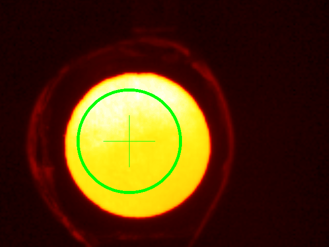

# ThermovisorImages
[](https://manarom.github.io/ThermovisorData.jl)
[](https://github.com/Manarom/ThermovisorData.jl/actions/workflows/CI.yml?query=branch%3Amaster)


**ThervisorImages.jl** is a small package designed to process static thermal images stored as matrices. Each matrix element represents a temperature value. Package enables users to load images from csv-files, calculate temperature distributions, and compute statistical analyses for temperatures along specified lines. It also calculates averaged angular and radial temperature distributions (along with standard deviations) within Regions of Interest (ROIs) such as circless, squares, and rectangles. These ROI objects can be fitted to thermally distinct areas (relative to their surroundings), such as the most heated regions within the scene.

Initial image and filtered image with ROI, temperature distribution is evaluated along the inclined line
<p float="left">
  
   
</p>

The following figures show temperature distribution along the line, radial and angular distribution across the ROI
<p float="left">
  
  
   
</p>
The following figures show (left) the initial image with several separate patterns and the same figure with several ROIs fitted to the patterns (righ)
<p float="left">
  
   
</p>

 Detailed explanation of this images is given in  [notebook] folder in [Pluto](https://plutojl.org/) notebook, which can be used as an example of package usage.


  Full documentation is available at  [documentation](https://manarom.github.io/ThermovisorData.jl/)

## Quick start

```julia
import Pkg 
Pkg.add("https://github.com/Manarom/ThermovisorImages.jl.git")
using ThermovisorImages
im = read_jdx_file(file_name) # to read the file, data.x - x-values, data.y - y values
write_jdx_file(x,y,"MKM","TRANSMITTANCE") # to write x- and y- data vectors

```

#### For usage

2a) Clone this repository to your local machine 

3a) use `include("thermovisor_data_folder\src\ThermovisorData.jl)` in REPL or other module's to bring ThermovisorData module to the global scope

4a) use `using .ThermovisorData` to bring the module and its content to the corresponding namespace

#### For development

2c) Clone this repository to `username/.julia/dev/`.

3c) Enter the package manager in REPL by pressing `]`  then add the package by typing `dev ThermovisorData`
