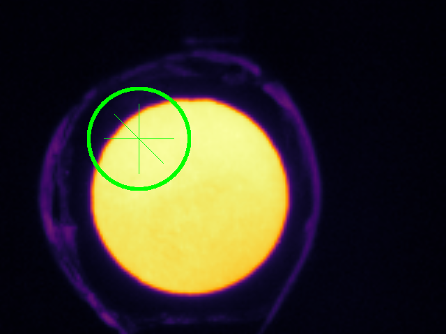
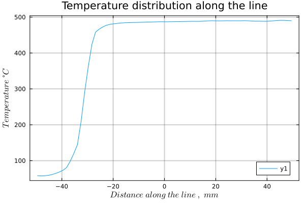
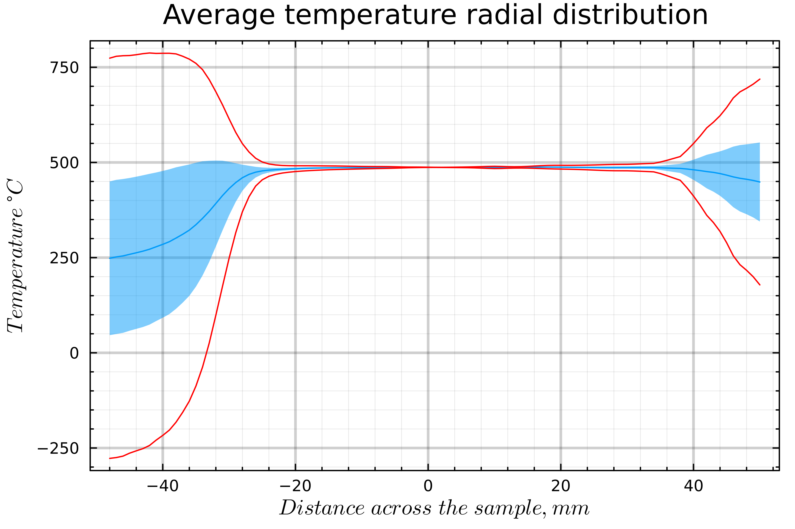
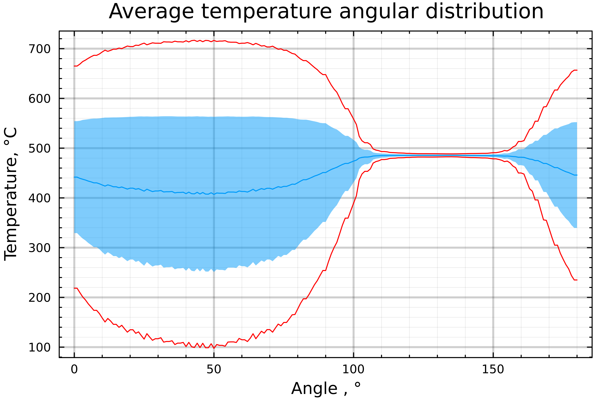
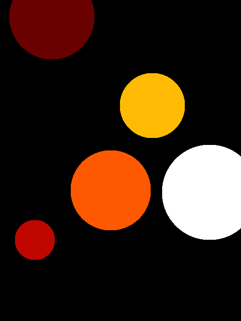
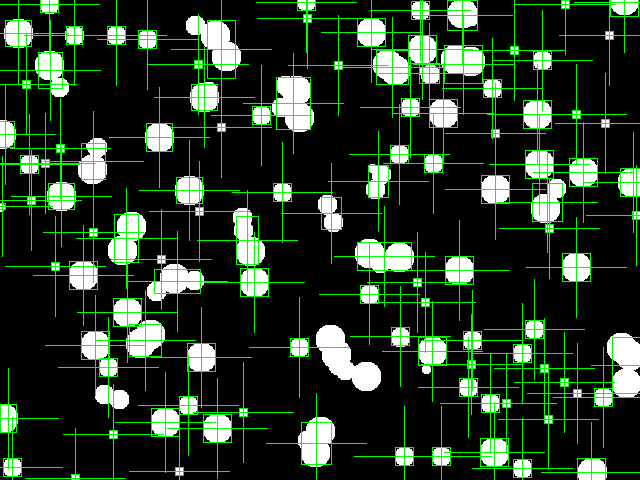
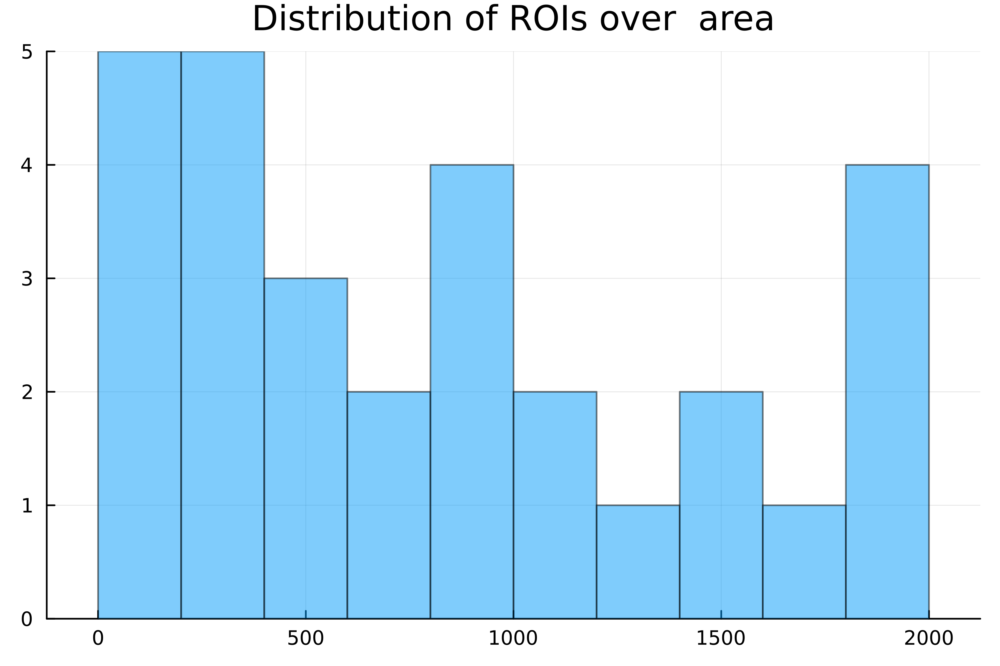

# ThermovisorImages
[](https://manarom.github.io/ThermovisorData.jl)
[](https://github.com/Manarom/ThermovisorData.jl/actions/workflows/CI.yml?query=branch%3Amaster)


**ThermovisorImages.jl** is designed to process static thermal images stored as matrices in CSV files or as image files. It treats each matrix element as a temperature value. ThermovisorImages.jl provides functions to calculate temperature distributions and perform statistical analyses of temperatures within Regions of Interest (ROIs), such as circles, squares, rectangles, or along lines. ROI objects can be fitted to image patterns (regions that stand out from the background). It is also possible to evaluate statistics across multiple ROIs, including distributions of side length, area, and perimeter.

**ThermovisorImages.jl** also provides functions to recalculate the temperature distribution of the entire image (or its part within the ROI or labeled pattern), taking into account the emissivity of the surface and the spectral range of the infrared camera.

This package was designed to study the temperature distribution across the heated sample for the emissivity measuring facility described in this [`paper`](https://link.springer.com/article/10.1007/s00340-024-08331-9)

The following figure shows the image with the ROI object on it:
<p float="left">
   
</p>

The following figures show temperature distribution along the inclined line, and radial and angular distribution of all points within the ROI
<p float="left">
  
  
   
</p>
The following figures show the initial image with several separate patterns and the same figure with several ROIs fitted to the patterns and histogram of ROis distribution over the size parameter
<p float="left">
  
   
   
</p>

 Main functionality of the package is demonstrated in the Pluto [notebook](https://github.com/Manarom/ThermovisorImages.jl/blob/main/notebooks). Static version of this notebook is available at [ThermovisorImages-test](https://manarom.github.io/ThermovisorImages.jl/ThermovisorImages-test.html)

  Full documentation is available at  [documentation](https://manarom.github.io/ThermovisorImages.jl/)

## Installation

1) Install [`julia`](https://julialang.org/install/)

#### For usage

2) Clone this repository to your local machine in `project_folder` (any name)

3) In julia REPL type the following:

```julia
  import Pkg
  cd(project_folder) # sets working folder to project_folder
  Pkg.activate(".")
  include(".\\src\\ThermovisorImages.jl")
  using .ThermovisorImages #to bring the module and its content to the corresponding namespace
```

#### For development

2) Clone this repository to `username/.julia/dev/`.

3) Enter the package manager in REPL by pressing `]`  then add the package by typing `dev ThermovisorImages`
